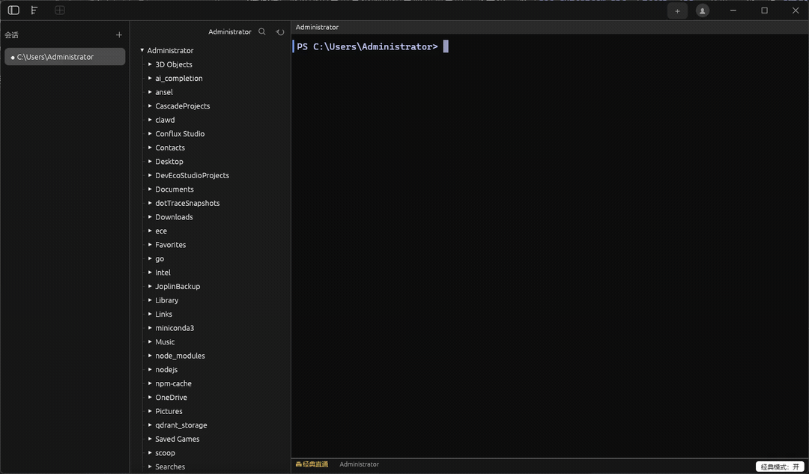
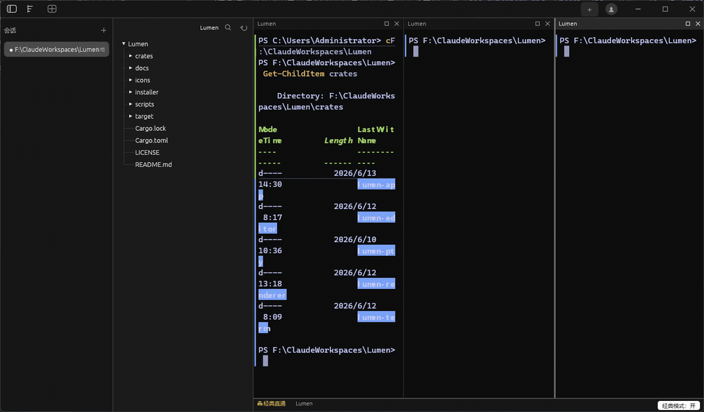
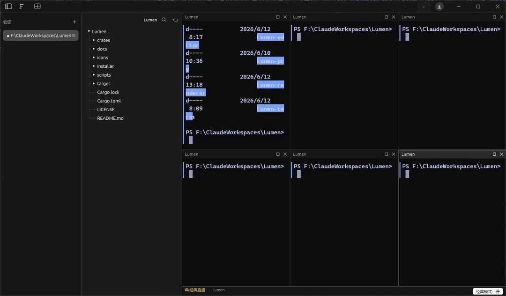

<p align="center">
  
</p>

<h1 align="center">Lumen</h1>

<p align="center">
  <strong>一个 Windows 优先、GPU 加速的现代终端：让命令行更像编辑器，也能安全接管自己的远程设备。</strong>
</p>

<p align="center">
  <a href="README.md">English</a> · <strong>简体中文</strong> ·
  <a href="https://github.com/jimhy/lumen/releases">下载</a> ·
  <a href="#从源码运行">源码运行</a> ·
  <a href="server/deploy/README.md">自托管远程服务端</a>
</p>

<p align="center">
  
  
  
  
</p>

<p align="center">
  
</p>

Lumen 把原生 Windows 终端、编辑器式命令输入、命令块、文件树、主题系统和自托管远程控制放进一个 Rust 应用里。它面向每天大量使用 PowerShell、经常切项目、经常看日志和构建输出的开发者：少翻滚、少重敲、少在窗口之间来回跳。

> 当前状态：本地终端、现代输入编辑器、文件树、多窗格、自动更新、账号/服务端通道、远程设备控制、远程文件操作，以及 QUIC 辅助的 P2P 数据通道均已实现，正在持续打磨。

## 为什么值得试

| 你想做什么 | 用 Lumen 的哪里 | 它怎么帮你 |
|---|---|---|
| 写复杂命令不怕输错 | 多行底部输入区、PowerShell 高亮、续行检测 | 先像写代码一样编辑命令，确认后再执行。 |
| 快速找回以前的命令 | `Ctrl+R` 模糊历史、`↑/↓` 历史、Ghost text、`Tab` 补全 | 少重复输入，少打断思路。 |
| 一眼看懂刚才跑了什么 | 命令块、退出码、耗时、块选择 | 每条命令都是可跳转、可复制、可定位的输出单元。 |
| 同时盯构建、日志和服务 | 最多 6 窗格、拖动比例、最大化、拖标题换位 | 一个窗口里保留多个上下文。 |
| 不离开终端管理项目文件 | `Ctrl+B` 文件树、右键操作、拖文件插入路径 | `cd`、复制路径、新建/删除文件更顺手。 |
| 控制自己的另一台电脑 | 自托管 `lumen-server`、双端登录、9 位配对码 | 镜像并控制远端 Lumen，还能双向传文件。 |
| 调成自己愿意常驻的样子 | 11 个主题、跟随系统深浅、背景图、中英界面 | 终端是长期工作台，舒服很重要。 |

## 录屏与截图

| 本地工作区 | 命令工作流 | 六窗格分屏 |
|---|---|---|
|  |  |  |

## 快速上手

### 安装

从 [GitHub Releases](https://github.com/jimhy/lumen/releases) 下载 Windows 构建产物，运行 `lumen.exe`。

运行要求：

- Windows 10 1809+，用于 ConPTY。
- PowerShell：优先使用 `pwsh`，未安装时回退到 Windows PowerShell。

### 前 3 分钟可以这样试

| 操作 | 快捷键或位置 |
|---|---|
| 新建会话 | `Ctrl+T` |
| 新增窗格 | `Ctrl+Shift+D` |
| 打开/关闭文件树 | `Ctrl+B` |
| 打开设置 | `Ctrl+,` |
| 搜索历史命令 | `Ctrl+R` |
| 命令里换行，不立即执行 | `Shift+Enter` |
| 接受 Ghost text | `→` 或 `End` |
| 打开输出里的链接或文件路径 | `Ctrl+单击` |

## 亮点功能

### 像编辑器一样写命令

Lumen 给命令一个独立输入区，而不是把所有编辑都塞在提示符后面。你可以多行编辑、看 PowerShell 语法高亮、自动处理引号/管道未闭合的续行、搜索历史、补全命令和路径、接受 Ghost text，也可以随时用 `Ctrl+Shift+E` 切回经典直通模式。

### 命令块让输出更清楚

通过 shell integration 的 OSC 133，Lumen 能识别命令边界。命令完成后会显示成功/失败状态和耗时；你可以在命令块之间跳转，也可以选中某个块的输出再复制。

### GPU 渲染的终端底座

渲染层使用 `wgpu` + `glyphon`，并用自绘矩形管线处理背景色块、光标和下划线。终端核心支持 ANSI/VT、真彩色、备用屏幕程序（如 `vim`/`less`）、bracketed paste、同步更新、10k 行回滚、中文 IME 预编辑和可点击链接。

### 面向项目的应用外壳

Lumen 有会话、窗格、文件树、自绘标题栏、Win11 Snap Layouts、持久化布局宽度、系统 toast，以及 Lumen、Tokyo Night、Dracula、Nord、Gruvbox、Solarized、Catppuccin、One Dark 等内置主题。

### 自托管远程控制

在自己的机器或 VPS 上运行 `lumen-server`，在 Lumen 设置里填服务端地址，然后两台设备登录同一个账号。远程页会显示在线设备；双击连接，输入被控端展示的 9 位配对码，即可开始控制。

远程会话支持终端镜像与控制、远程标签/窗格、远程文件树、上传/下载、通过虚拟文件剪贴板复制目录；网络直连可用时走 QUIC P2P 数据通道，不可用时自动回退中继。

从这里开始：

- [服务端说明](server/lumen-server/README.md)
- [生产部署指南](server/deploy/README.md)

## 从源码运行

```powershell
# 克隆仓库并进入目录后：
cargo run -p lumen-app

# 发布构建
cargo build -p lumen-app --release
.\target\release\lumen.exe
```

现代输入编辑器默认开启，对应 `input-editor` feature。如果你想构建传统逐字节终端：

```powershell
cargo run -p lumen-app --no-default-features
```

本地启动自托管服务端：

```powershell
cargo run -p lumen-server
```

## 常用快捷键

| 快捷键 | 功能 |
|---|---|
| `Ctrl+T` | 新建会话 |
| `Ctrl+W` | 关闭当前会话 |
| `Ctrl+Tab` / `Ctrl+Shift+Tab` | 下一个 / 上一个会话 |
| `Ctrl+B` | 文件树开合 |
| `Ctrl+,` | 打开 / 关闭设置 |
| `Ctrl+↑` / `Ctrl+↓` | 命令块间跳转 |
| `Ctrl+C` | 复制选区或选中块输出；无选择时发送中断 |
| `Ctrl+V` / `Shift+Insert` | 粘贴 |
| `Shift+PgUp` / `Shift+PgDn` | 上下翻屏 |
| `Esc` | 关闭设置或覆盖层 |
| `Ctrl+Shift+D` | 新增窗格 |
| `Ctrl+Shift+W` | 关闭窗格 |
| `Ctrl+Shift+Enter` | 窗格最大化 / 还原 |
| `Ctrl+R` | 模糊历史搜索 |
| `Tab` | 补全 |
| `Shift+Enter` | 插入换行 |
| `Ctrl+Shift+E` | 切换经典直通模式 |
| `Ctrl+单击` | 打开终端里的链接或文件路径 |

## 架构

```text
crates/
├── lumen-pty/       # PTY 抽象：Windows ConPTY / portable-pty
├── lumen-term/      # VT 解析、Grid、回滚、命令块
├── lumen-editor/    # 纯命令编辑器状态机
├── lumen-renderer/  # wgpu + glyphon 渲染器
├── lumen-protocol/  # 客户端/服务端共享的远程控制协议
└── lumen-app/       # winit + egui 应用外壳、会话、窗格、设置、远程 UI

server/
└── lumen-server/    # Axum 服务端：账号、设备、同步、WebSocket 中继、STUN 辅助
```

数据流：PTY 字节 -> `lumen-term` -> grid/block model -> `lumen-renderer`。键盘、鼠标、IME、文件树和远程事件由 `lumen-app` 路由；编辑器模式会先经过 `lumen-editor`，再把最终字节提交回 PTY。

深入文档：

- [架构设计](docs/架构设计.md)
- [输入编辑器设计](docs/输入编辑器设计.md)
- [远程控制设计](docs/M5远程控制设计.md)
- [P2P 直连设计](docs/M6-P2P直连-QUIC打洞-设计-2026-06-23.md)

## 路线图

- 本地终端底座：ConPTY、ANSI/VT、GPU 渲染、命令块
- 应用外壳：自绘标题栏、窗格、文件树、设置、主题、i18n
- 现代输入编辑器：多行输入、高亮、历史、补全、链接
- 更新：GitHub Release 自动更新与代理支持
- 远程：账号、设备、配对、终端控制、文件传输、中继/P2P 通道
- 下一步：AI 辅助命令生成与报错解释
- 下一步：进一步打磨同步与跨设备工作流

## 参与贡献

欢迎把 Lumen 放进你的真实工作流里试：开 issue、贴复现步骤、分享录屏，或者帮忙测试不同 NAT/网络环境下的远程控制。越具体的反馈，越容易变成下一次改进。

## 许可

[Apache-2.0](LICENSE) © jimhy
