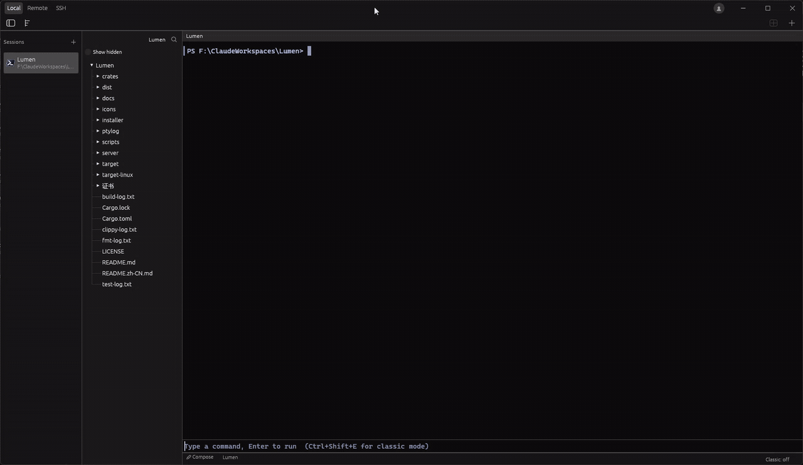
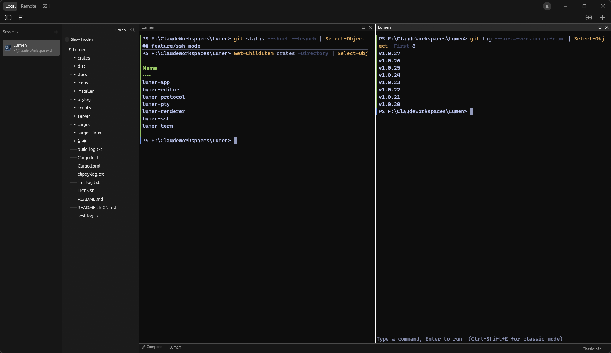
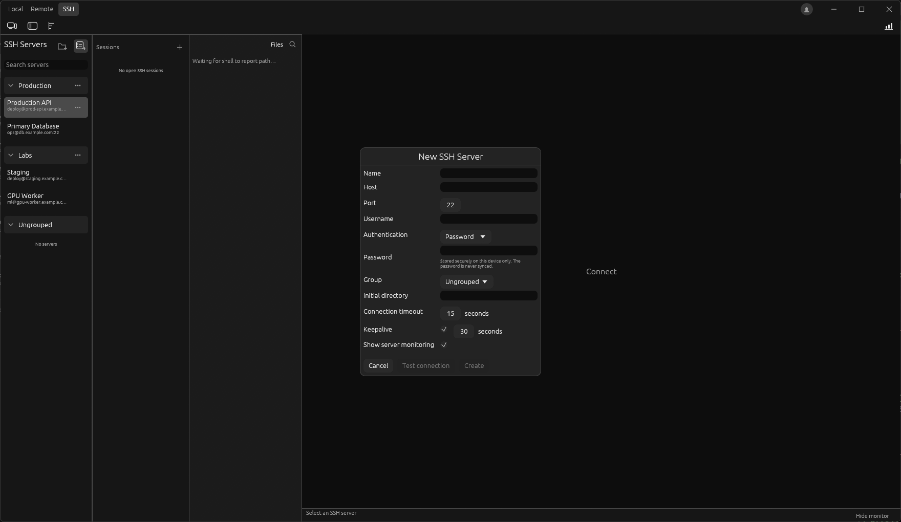
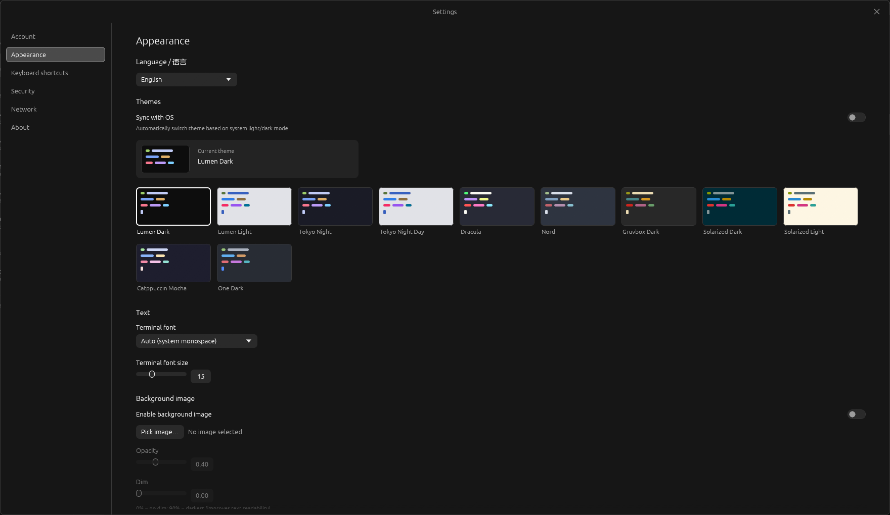

<p align="center">
  
</p>

<h1 align="center">Lumen</h1>

<p align="center">
  <strong>从本地项目到 SSH 集群，再到你自己的远程设备——一个真正围绕命令行工作的终端工作台。</strong>
</p>

<p align="center">
  <a href="README.md">English</a> · <strong>简体中文</strong> ·
  <a href="https://github.com/jimhy/lumen/releases"><strong>下载</strong></a> ·
  <a href="#从源码构建">源码构建</a> ·
  <a href="server/deploy/README.md">自托管远程服务</a>
</p>

<p align="center">
  <a href="https://github.com/jimhy/lumen/releases"></a>
  <a href="https://github.com/jimhy/lumen/actions/workflows/ci.yml"></a>
  
  
  
</p>

<p align="center">
  
</p>

Lumen 是一款用 Rust 编写、GPU 加速的原生终端工作台。它把编辑器式命令输入、
可读的命令块、持久化会话、项目文件、SSH/SFTP、服务器监控和自托管远程控制整合到
一个专注的桌面应用里。

没有 Electron 外壳，不强制使用厂商托管账号，也不用为了“执行命令、看文件、盯进程、
连另一台机器”同时开五个工具。

> **项目状态：** 本地终端、SSH/SFTP 工作区、远程文本编辑器、服务器监控、应用锁、
> 自托管设备控制、中继回退和 QUIC P2P 通道均已实现并持续打磨。内置浏览器与 AI
> 辅助工作流仍在路线图中，本文不会把未完成能力当成现有功能宣传。

## 为什么开发者会喜欢 Lumen

| | |
|---|---|
| **放心写完，再执行**<br>多行输入、PowerShell 高亮、续行判断、补全、Ghost text、草稿恢复和模糊历史搜索，让复杂命令更像写代码。 | **让整个项目留在视野里**<br>持久化会话、最多六窗格、可搜索文件树、拖动布局和命令块，减少窗口切换和无尽翻滚。 |
| **不离开终端就能运维服务器**<br>分组管理 SSH，独立开启多个 Shell，浏览 SFTP，编辑远程文件，查看指标，按进程或端口搜索并结束异常进程。 | **在自己的基础设施上控制设备**<br>自托管 `lumen-server`，短码配对，镜像会话与窗格，传输文件；网络允许时自动使用低延迟 QUIC 直连。 |

## 看看真实的 Lumen

### 围绕项目组织的本地工作区

<p align="center">
  
</p>

| SSH 工作区 | 调成你喜欢的样子 |
|---|---|
|  |  |
| 分组与搜索服务器，选择密码/私钥/Agent 认证，开启多个 Shell，浏览 SFTP、编辑文件并监控主机。 | 11 个主题、跟随系统深浅、字体与字号、背景图，以及英文、简体中文、繁体中文界面。 |

以上 GIF 和截图均来自真实的英文界面，适合直接用于全球宣传。SSH 名称与地址来自隔离的
演示数据，不包含任何真实服务器、账号或凭据。

## 安装

### Windows

从 [GitHub Releases](https://github.com/jimhy/lumen/releases) 下载
`Lumen-Setup-*.exe` 并运行安装程序。

- ConPTY 要求 Windows 10 1809 或更新版本。
- 优先使用 PowerShell 7（`pwsh`），未安装时回退 Windows PowerShell。
- Windows 版支持在 Lumen 内检查、下载并安装更新。

### Linux

Release 提供 x86_64 通用压缩包和 `.deb`。Debian / Ubuntu 推荐：

```bash
sudo apt install ./lumen-app_*_amd64.deb
```

`.deb` 会声明桌面依赖；通用压缩包适合便携部署或非 Debian 发行版，需要系统具备可用的
Vulkan/OpenGL 图形栈和文档所列桌面库。

### macOS

[macOS 打包工作流](https://github.com/jimhy/lumen/actions/workflows/package-macos.yml)
会同时构建 Apple Silicon 与 Intel 的通用 `Lumen.app`。当前应用包尚未签名，首次打开时
可能需要在 macOS 中显式允许；也可以直接从源码构建。

## 前五分钟这样体验

1. 在本地终端进入一个项目目录，文件树会跟随 Shell 上报的工作目录。
2. 按 `Ctrl+Shift+D` 分屏，把构建、服务、日志或 REPL 分别留在不同窗格。
3. 按 `Ctrl+R` 搜索历史，也可以用 `↑` / `↓`、补全和 Ghost text 复用旧命令。
4. 打开 **SSH** 页，创建服务器配置，核验主机密钥指纹，然后在同一窗口获得 Shell、
   SFTP 文件树、编辑器和监控面板。

常用快捷键：

| 操作 | 快捷键 |
|---|---|
| 新建 / 关闭会话 | `Ctrl+T` / `Ctrl+W` |
| 下一个 / 上一个会话 | `Ctrl+Tab` / `Ctrl+Shift+Tab` |
| 新增 / 关闭窗格 | `Ctrl+Shift+D` / `Ctrl+Shift+W` |
| 窗格最大化 / 还原 | `Ctrl+Shift+Enter` |
| 打开 / 关闭项目文件树 | `Ctrl+B` |
| 打开设置 | `Ctrl+,` |
| 模糊搜索命令历史 | `Ctrl+R` |
| 换行但不立即执行 | `Shift+Enter` |
| 在命令块之间跳转 | `Ctrl+↑` / `Ctrl+↓` |
| 切换经典直通模式 | `Ctrl+Shift+E` |
| 打开 URL 或文件路径 | `Ctrl+单击` |

## 完整功能

### 现代终端与命令工作流

| 能力 | 具体体验 |
|---|---|
| 编辑器式输入 | 独立的多行命令区，支持选择、剪切/复制/粘贴、按 Unicode grapheme 移动光标、撤销/重做、草稿恢复和智能提交。 |
| PowerShell 智能体验 | 语法高亮、引号/管道续行检测、命令与路径补全、历史导航、Ghost text、`Ctrl+R` 模糊搜索。 |
| 命令块 | 通过 OSC 133/633 识别命令边界，显示成功/失败与耗时，支持块选择、复制块输出和键盘跳转。 |
| 经典兼容 | 一组快捷键随时切回逐字节直通，兼容 Shell、REPL、TUI 和偏好传统终端行为的工作流。 |
| 终端核心 | ANSI/VT、真彩色、Vim/`less` 等备用屏幕程序、bracketed paste、同步更新、鼠标协议、10k 行回滚、可拖滚动条和可点击链接/路径。 |
| 国际化输入 | 中日韩 IME 预编辑、emoji/grapheme 级编辑、跨平台字体回退，以及英文/简中/繁中界面。 |
| GPU 渲染 | `wgpu` + `glyphon`，背景色块、光标、选择和装饰线使用自定义渲染。 |

### 会话、窗格与项目文件

| 能力 | 具体体验 |
|---|---|
| 持久化会话 | 会话名称、工作目录、窗格拓扑、窗格比例和活动状态在重启后恢复。 |
| 灵活分屏 | 每个会话最多六窗格，支持拖动比例、最大化/还原、重置布局、窗格换位和自定义名称。 |
| 项目文件树 | 递归搜索、隐藏项开关、目录级刷新、新建/重命名、移入回收站、在系统文件管理器中打开、复制绝对/相对路径。 |
| 原生文件工作流 | 通过系统文件剪贴板复制粘贴文件和目录；把外部文件拖进终端可直接插入路径。 |
| 桌面集成 | 自绘标题栏、Windows 11 Snap Layouts、会话前台进程图标、系统通知、单实例前台唤醒，以及记忆侧栏宽度/显隐。 |
| 个性化 | 11 个内置深浅主题、跟随系统主题、终端字体与字号、带透明度/暗化的背景图、持久化布局偏好。 |
| 更新与网络 | 应用内检查更新、Windows 安装器接续、跳过指定版本，以及可选 HTTP/HTTPS/SOCKS5 代理。 |

### SSH、SFTP、远程编辑与服务器运维

| 能力 | 具体体验 |
|---|---|
| 服务器清单 | 可搜索配置、自定义分组与排序、初始目录、连接超时、可选 Keepalive、断线重连、账号范围内的配置元数据同步。 |
| 认证方式 | 密码、带可选口令的私钥、SSH Agent。凭据和私钥路径只保留在当前设备，绝不参与同步。 |
| 主机密钥安全 | 首次连接确认指纹；已保存的主机密钥发生变化时默认阻断连接。 |
| 独立 Shell | 同一 SSH 主机可以同时打开多个独立会话，各自拥有终端状态和重连生命周期。 |
| SFTP 工作区 | 远程文件树、隐藏项、新建/重命名/删除、上传/下载、本地↔远程剪贴板流程，以及粘贴到系统文件管理器。 |
| 内置文本编辑器 | UTF-8 远程编辑、常见语言高亮、本地补全、代码片段、查找/替换、跳转行、软换行、注释、撤销/重做、保存冲突检测与安全的重载/覆盖选择。 |
| 实时服务器面板 | CPU 与逐核使用率、内存、负载、文件系统与磁盘 I/O、网络速度/流量、运行时长、系统/内核/时区，以及可折叠卡片。 |
| 进程与端口工具 | 自动刷新的进程列表、CPU/内存排序、进程名搜索、`:端口` 查询、进程详情，以及带确认的终止/强杀操作。 |

编辑器能识别 JSON、YAML、TOML、Rust、Python、JavaScript/TypeScript、Shell、
PowerShell、Go、Java/Kotlin、C/C++/C#、HTML/Vue/Svelte、XML/SVG、CSS、SQL、
Markdown 和 Dockerfile。

### 自托管远程设备控制

在自己的电脑或 VPS 上运行 `lumen-server`，让各设备指向它并登录同一账号。

| 能力 | 具体体验 |
|---|---|
| 设备在线状态 | 在线/离线列表、稳定设备身份和显式删除设备。 |
| 同意与配对 | 被控端确认远程请求，并展示 9 位短时配对码。 |
| 完整终端工作区 | 镜像并控制远端终端、会话、窗格布局、标题、工作目录、回滚历史、链接和进程图标。 |
| 远程文件 | 浏览文件树，新建/重命名/删除，上传/下载，递归复制目录，并把取回的文件粘贴到系统文件管理器。 |
| 网络韧性 | 已认证 WebSocket 信令/中继；可用时切换到带双向 TLS 与指纹固定的 QUIC 直连；断开时自动回退中继、重连并恢复会话。 |
| 使用自己的基础设施 | 仓库包含 Axum 服务端、PostgreSQL 存储、TLS 反代示例、systemd 单元和生产部署指南。 |

从这里开始：

- [服务端说明](server/lumen-server/README.md)
- [生产部署指南](server/deploy/README.md)
- [远程控制设计](docs/M5远程控制设计.md)
- [QUIC P2P 设计](docs/M6-P2P直连-QUIC打洞-设计-2026-06-23.md)

## 安全模型

- SSH 密码和私钥口令只保存在本地：Windows 使用 Credential Manager，Unix 构建使用
  加密的本地凭据文件。凭据材料不会进入账号同步。
- SSH 主机密钥发生变化时默认阻断，必须由用户独立核验后显式更新信任。
- 应用锁支持立即锁定、启动时锁定、系统恢复后锁定和空闲超时。密码使用 Argon2id
  校验，敏感 UI 缓冲会在使用后清空。
- 远程控制要求已认证设备、被控端明确同意和短时配对码。QUIC 直连双方使用经认证信令
  通道交换的指纹相互验证。
- 远程服务可以完全自托管。暴露到公网前请配置 TLS，并遵循部署指南设置密钥与数据库。

## 从源码构建

准备：

- 桌面工作区需要 Rust 1.92 或更新版本。
- 安装 `winit`、`wgpu` 与原生文件对话框后端所需的平台构建依赖。
- Windows 需要带 MSVC 工具链的 Visual Studio Build Tools。

```powershell
# 运行默认启用现代输入编辑器的桌面应用
cargo run -p lumen-app

# 构建优化版桌面程序
cargo build -p lumen-app --release

# 运行经典逐字节终端变体
cargo run -p lumen-app --no-default-features

# 本地运行自托管服务
cargo run -p lumen-server
```

### 仓库结构

```text
crates/
├── lumen-pty/       # ConPTY / portable PTY 抽象
├── lumen-term/      # VT 解析、Grid、回滚、链接、命令块
├── lumen-editor/    # 纯命令编辑器状态机
├── lumen-renderer/  # wgpu + glyphon 终端渲染器
├── lumen-ssh/       # SSH 传输、SFTP、指标、进程/端口管理
├── lumen-protocol/  # 远程控制与同步协议
└── lumen-app/       # winit + egui 桌面外壳

server/
└── lumen-server/    # 账号、设备、SSH 元数据同步、中继、STUN 辅助
```

深入文档：

- [架构设计](docs/架构设计.md)
- [现代输入编辑器](docs/输入编辑器设计.md)
- [SSH 模式产品与设计说明](docs/SSH模式-PRD-2026-07-23.md)

## 路线图

- AI 辅助命令生成与报错解释
- 带自动化桥接的内置浏览器
- 进一步打磨跨设备同步和复杂网络边界
- macOS 签名与公证分发

## 参与贡献

真实工作流就是最好的测试。欢迎提交可复现的终端场景、SSH/SFTP 边界问题、网络拓扑、
短录屏或聚焦的改进提案；也欢迎 PR 和跨平台测试。

## 许可

[Apache-2.0](LICENSE) © jimhy
